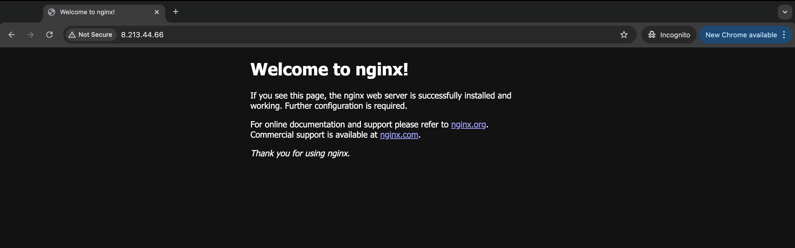

# iac_alicloud


Terraform will perform the following actions:

  # alicloud_instance.web will be created
  + resource "alicloud_instance" "web" {
      + availability_zone                  = "me-central-1a"
      + cpu                                = (known after apply)
      + credit_specification               = (known after apply)
      + deletion_protection                = false
      + deployment_set_group_no            = (known after apply)
      + description                        = (known after apply)
      + dry_run                            = false
      + enable_jumbo_frame                 = (known after apply)
      + host_name                          = (known after apply)
      + http_endpoint                      = (known after apply)
      + http_put_response_hop_limit        = (known after apply)
      + http_tokens                        = (known after apply)
      + id                                 = (known after apply)
      + image_id                           = "ubuntu_24_04_x64_20G_alibase_20240812.vhd"
      + instance_charge_type               = "PostPaid"
      + instance_name                      = "bastion"
      + instance_type                      = "ecs.g6.large"
      + internet_charge_type               = "PayByTraffic"
      + internet_max_bandwidth_in          = (known after apply)
      + internet_max_bandwidth_out         = 100
      + io_optimized                       = (known after apply)
      + ipv6_address_count                 = (known after apply)
      + ipv6_addresses                     = (known after apply)
      + key_name                           = "ssh-key"
      + maintenance_action                 = (known after apply)
      + memory                             = (known after apply)
      + network_interface_id               = (known after apply)
      + network_interface_traffic_mode     = (known after apply)
      + os_name                            = (known after apply)
      + os_type                            = (known after apply)
      + period                             = (known after apply)
      + primary_ip_address                 = (known after apply)
      + private_ip                         = (known after apply)
      + public_ip                          = (known after apply)
      + resource_group_id                  = (known after apply)
      + role_name                          = (known after apply)
      + secondary_private_ip_address_count = (known after apply)
      + secondary_private_ips              = (known after apply)
      + security_enhancement_strategy      = (known after apply)
      + security_groups                    = (known after apply)
      + spot_duration                      = (known after apply)
      + spot_price_limit                   = (known after apply)
      + spot_strategy                      = (known after apply)
      + status                             = (known after apply)
      + stopped_mode                       = (known after apply)
      + subnet_id                          = (known after apply)
      + system_disk_category               = "cloud_essd"
      + system_disk_description            = (known after apply)
      + system_disk_encrypted              = (known after apply)
      + system_disk_id                     = (known after apply)
      + system_disk_name                   = (known after apply)
      + system_disk_performance_level      = (known after apply)
      + system_disk_size                   = (known after apply)
      + user_data                          = "I2Nsb3VkLWNvbmZpZwpwYWNrYWdlX3JlYm9vdF9pZl9yZXF1aXJlZDogdHJ1ZQpwYWNrYWdlX3VwZGF0ZTogdHJ1ZQpwYWNrYWdlX3VwZ3JhZGU6IHRydWUKcGFja2FnZXM6Ci0gYXB0OiAKICAtIGdpdCAKICAtIGN1cmwgCiAgLSBuZ2lueA=="
      + volume_tags                        = (known after apply)
      + vpc_id                             = (known after apply)
      + vswitch_id                         = (known after apply)

      + data_disks {
          + category             = "cloud_essd"
          + delete_with_instance = true
          + encrypted            = false
          + name                 = "public-disk"
          + performance_level    = (known after apply)
          + size                 = 40
        }

      + network_interfaces (known after apply)
    }

  # alicloud_key_pair.publickey will be created
  + resource "alicloud_key_pair" "publickey" {
      + finger_print  = (known after apply)
      + id            = (known after apply)
      + key_file      = "ssh-key.pem"
      + key_name      = (known after apply)
      + key_pair_name = "ssh-key"
    }

  # alicloud_security_group.web will be created
  + resource "alicloud_security_group" "web" {
      + description         = "this is web securety group for web and http"
      + id                  = (known after apply)
      + inner_access        = (known after apply)
      + inner_access_policy = (known after apply)
      + name                = "web-sg"
      + security_group_type = (known after apply)
      + vpc_id              = (known after apply)
    }

  # alicloud_security_group_rule.allow_http_to_web will be created
  + resource "alicloud_security_group_rule" "allow_http_to_web" {
      + cidr_ip           = "0.0.0.0/0"
      + id                = (known after apply)
      + ip_protocol       = "tcp"
      + nic_type          = (known after apply)
      + policy            = "accept"
      + port_range        = "80/80"
      + prefix_list_id    = (known after apply)
      + priority          = 1
      + security_group_id = (known after apply)
      + type              = "ingress"
    }

  # alicloud_security_group_rule.allow_ssh_to_web will be created
  + resource "alicloud_security_group_rule" "allow_ssh_to_web" {
      + cidr_ip           = "0.0.0.0/0"
      + id                = (known after apply)
      + ip_protocol       = "tcp"
      + nic_type          = (known after apply)
      + policy            = "accept"
      + port_range        = "22/22"
      + prefix_list_id    = (known after apply)
      + priority          = 1
      + security_group_id = (known after apply)
      + type              = "ingress"
    }

  # alicloud_vpc.vpc will be created
  + resource "alicloud_vpc" "vpc" {
      + cidr_block            = "10.0.0.0/8"
      + create_time           = (known after apply)
      + id                    = (known after apply)
      + ipv6_cidr_block       = (known after apply)
      + ipv6_cidr_blocks      = (known after apply)
      + name                  = (known after apply)
      + resource_group_id     = (known after apply)
      + route_table_id        = (known after apply)
      + router_id             = (known after apply)
      + router_table_id       = (known after apply)
      + secondary_cidr_blocks = (known after apply)
      + status                = (known after apply)
      + user_cidrs            = (known after apply)
      + vpc_name              = "VPC"
    }

  # alicloud_vswitch.private will be created
  + resource "alicloud_vswitch" "private" {
      + availability_zone    = (known after apply)
      + cidr_block           = "10.0.2.0/24"
      + create_time          = (known after apply)
      + id                   = (known after apply)
      + ipv6_cidr_block      = (known after apply)
      + ipv6_cidr_block_mask = (known after apply)
      + name                 = (known after apply)
      + status               = (known after apply)
      + vpc_id               = (known after apply)
      + vswitch_name         = "private-vswitch"
      + zone_id              = "me-central-1a"
    }

  # alicloud_vswitch.public will be created
  + resource "alicloud_vswitch" "public" {
      + availability_zone    = (known after apply)
      + cidr_block           = "10.0.1.0/24"
      + create_time          = (known after apply)
      + id                   = (known after apply)
      + ipv6_cidr_block      = (known after apply)
      + ipv6_cidr_block_mask = (known after apply)
      + name                 = (known after apply)
      + status               = (known after apply)
      + vpc_id               = (known after apply)
      + vswitch_name         = "public-vswitch"
      + zone_id              = "me-central-1a"
    }

Plan: 8 to add, 0 to change, 0 to destroy.

Changes to Outputs:
  + web_public_ip = (known after apply)


# output

```
Apply complete! Resources: 8 added, 0 changed, 0 destroyed.

Outputs:

web_public_ip = "8.213.44.66"
```

